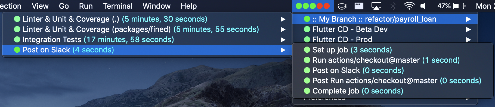
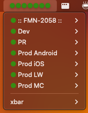

# GitHub Build Monitor - Github Actions status for multiple repositories under a Github organization on macOS menu bar

This is a fork from [this repo](https://github.com/paulononaka/bitactions/) that adds support to multiple repositories under a given organization.
It also introduces new configurations for filtering both repositories and workflows by name.
It removes support for monitoring the workflows of the current branch of a given local repo.
It only works for repositories under a Github org.

## Example



## Prerequisites

- [Node.js](https://nodejs.org/)
- [XBar](https://xbarapp.com/)
- Open xbar

## Installation

Make sure you have `node` and `npm`, then run:
```sh
curl https://raw.githubusercontent.com/jpaulorio/github-build-monitor/master/install.sh | bash
```

## Configuration

Create a `.bitactionsrc` file in your $HOME with the following content:

```json
{
    "githubToken": "<Your personal classic Git hub token. Ex: aaa_xxxxxxxxxxxxxxxxxxxxxxxxxxxxxxxxxxxxxxxx>",
    "repoNames": "<You can get it from the end of the GithHub URL of the project you want to watch. Ex: [repo-one\", \"repo-two\"]>",
    "statusMode": "summary",
    "orgName": "<Name of your Github Org>",
    "ignoredRepos": "<An array of (partial) repo names to igore. Case insenstive. [\"not-mine\", \"not-this-either\"]>",
    "ignoredWorkflows": "<An array of (partial) workload names to igore. Case insenstive. [\"example\", \"deploy\", \"quality\"]>"
}
```

After the configuration, click on xbar your on Mac OS bar and refresh it. Wait a few seconds for the first Github request and voalá. The plugin should starts working.

## githubToken
// **Optional** Your personal classic Git hub token. A forty-digit alphanumeric string.

TLTR: Follow these steps at [docs.github.com](https://docs.github.com/en/authentication/keeping-your-account-and-data-secure/managing-your-personal-access-tokens#creating-a-personal-access-token-classic) to create a personal token (classic).

Github Build Monitor uses [Github Actions API](https://docs.github.com/en/rest/reference/actions). It is possible to use these APIs without any authentication for public repositories. However, for unauthenticated requests, the rate limit allows for up to 60 requests per hour (Details at [docs.github.com](https://docs.github.com/en/rest/overview/resources-in-the-rest-api#rate-limiting)). Authenticated requests have higher limits, up to 5000 requests per hour.

The token does not need to have any specific scope for public repositories. However, the token  needs to have `repo - Full control of private repositories` scope for private repositories.

## orgName
// **Required** - Name of your Github org. Ex: "acme_corporation"

You can get it from the first path segment of the GithHub URL of the project you want to watch.
Ex: `https://github.com/acme_corporation/my_project` becomes `acme_corporation`.

## repoNames
// **optional** - List of Github repo names. Ex: ["my_project", "another-project"]

You can get it from the end of the GithHub URL of the project you want to watch.
Ex: `https://github.com/acme_corporation/my_project` becomes `my_project`.

If not provided, all repositories your token has access to will be watched.

## ignoredRepos
// **optional** - List of partial repository names you don't want to watch. Case insenstive. Ex: ["test", "debug"]

## ignoredWorkflows
// **optional** - List of partial workflow names you don't want to watch. Case insenstive. Ex: ["test", "debug"]

## statusMode
// **Optional** - rotate or summary. Ex: summary

Choose how the macOS menu bar should appear in the macOS bar menu:

- summary - Shows all workflows at once, without workflows names.



- rotate - Rotates the workflow with its name, showing one at a time. NOT SUPPORTED YET


##

# How it works?
Github Build Monitor uses [Github Actions API](https://docs.github.com/en/rest/reference/actions) to get the related workflow to the recent git push and its status. It keeps on calling the APIs every time your Xbar refreshes.

# Contributing

Contribution with code or documentation by raising a [pull request](https://github.com/jpaulorio/github-build-monitor/pulls) are more than welcome! Head over to the [issues tab](https://github.com/jpaulorio/github-build-monitor/issues) to report any bug or suggest an improvement. 